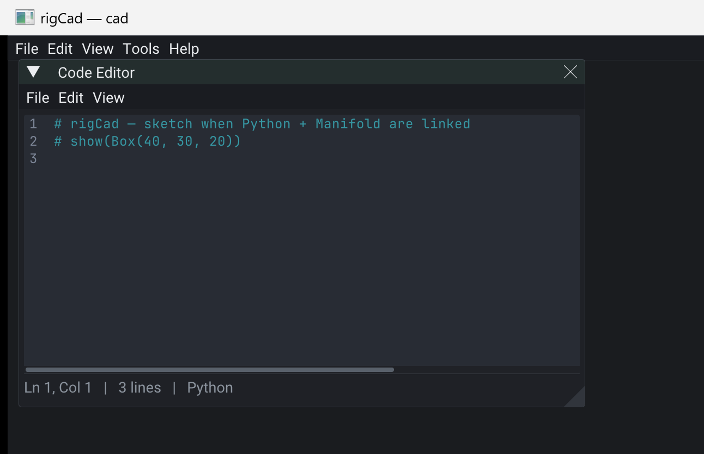

# rigCad





Live-scripted **3D CAD** orchestration — code editor + Python sketches + Manifold CSG.

## Depends

| Pack | Role |
|------|------|
| **rigCodeEditor** | Sketch buffer UI |
| **rigPython** | Embed + `eval` |
| **rigManifold** | CSG → `CMesh` |
| **rigRender3D** | Present solids (hero) |
| **rigImGui** | Host shell / windows |

## Status

When both embeds report `available()`, `ready()` is true. The pack installs a
`rigcad` Python module (`box`, `difference`, `union`, `show`) and runs a starter
sketch that spawns a `CMesh` entity. No fake Run when embeds are missing.

```python
from rigcad import box, difference, show
show(difference(box(40, 30, 20), box(20, 14, 12)))
```

## Hero

```bash
cmake -S packs/rigCad/examples/cad -B packs/rigCad/examples/cad/build
cmake --build packs/rigCad/examples/cad/build
./packs/rigCad/examples/cad/build/bin/cad/cad --smoke
```

## Pi note

Author tool (ImGui + CPython + Manifold). Keep off lean install apps.

## License

MIT.

[API/docs](https://rigkid.github.io/rigCad/)
